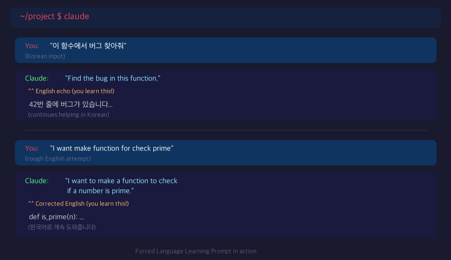

# Forced Language Learning Prompt

**Learn a new language effortlessly — just by using AI.**

No textbooks. No flashcards. No dedicated study time. Just a single prompt that turns every AI conversation into a language lesson.



## The Problem

You want to learn English (or any language), but:
- You don't have time for formal study
- You forget what you learned in classes
- You're afraid of making mistakes
- Traditional methods feel boring and disconnected from real work

## The Solution

Add one simple rule to your AI assistant, and **every conversation becomes a language lesson** — whether you're coding, writing, or just chatting.

```markdown
## Language Echo Rule
- When the user gives an instruction in **Korean**, first restate the instruction
  as a clear, correct English sentence, then proceed with the task in Korean.
- When the user gives an instruction in **English**, first show a refined/corrected
  version of the English sentence, then proceed with the task in Korean.
```

## How It Works

### You write in Korean → AI echoes it in English

```
You:    "이 함수에서 버그 찾아줘"
Claude: "Find the bug in this function."
        (then continues helping you in Korean)
```

You see how your thought looks in natural English. Zero effort.

### You try rough English → AI polishes it

```
You:    "I want make function for check prime number"
Claude: "I want to make a function to check if a number is prime."
        (then continues helping you in Korean)
```

No judgment. No red marks. Just a better version right next to yours.

## Quick Start with Claude Code

### Step 1: Find your language pair

Browse the [`languages/`](languages/) folder. Files are named `{native}-{target}.md`:

| I speak... | I want to learn... | File |
|---|---|---|
| 🇺🇸 English | 🇰🇷 Korean | [`en-ko.md`](languages/en-ko.md) |
| 🇺🇸 English | 🇯🇵 Japanese | [`en-ja.md`](languages/en-ja.md) |
| 🇺🇸 English | 🇨🇳 Chinese | [`en-zh.md`](languages/en-zh.md) |
| 🇺🇸 English | 🇪🇸 Spanish | [`en-es.md`](languages/en-es.md) |
| 🇺🇸 English | 🇫🇷 French | [`en-fr.md`](languages/en-fr.md) |
| 🇺🇸 English | 🇩🇪 German | [`en-de.md`](languages/en-de.md) |
| 🇺🇸 English | 🇧🇷 Portuguese | [`en-pt.md`](languages/en-pt.md) |
| 🇺🇸 English | 🇻🇳 Vietnamese | [`en-vi.md`](languages/en-vi.md) |
| 🇺🇸 English | 🇹🇭 Thai | [`en-th.md`](languages/en-th.md) |
| 🇺🇸 English | 🇸🇦 Arabic | [`en-ar.md`](languages/en-ar.md) |
| 🇰🇷 Korean | 🇺🇸 English | [`ko-en.md`](languages/ko-en.md) |
| 🇰🇷 Korean | 🇯🇵 Japanese | [`ko-ja.md`](languages/ko-ja.md) |
| 🇰🇷 Korean | 🇨🇳 Chinese | [`ko-zh.md`](languages/ko-zh.md) |
| 🇰🇷 Korean | 🇪🇸 Spanish | [`ko-es.md`](languages/ko-es.md) |
| 🇰🇷 Korean | 🇫🇷 French | [`ko-fr.md`](languages/ko-fr.md) |
| 🇰🇷 Korean | 🇩🇪 German | [`ko-de.md`](languages/ko-de.md) |
| 🇰🇷 Korean | 🇧🇷 Portuguese | [`ko-pt.md`](languages/ko-pt.md) |
| 🇰🇷 Korean | 🇻🇳 Vietnamese | [`ko-vi.md`](languages/ko-vi.md) |
| 🇰🇷 Korean | 🇹🇭 Thai | [`ko-th.md`](languages/ko-th.md) |
| 🇰🇷 Korean | 🇸🇦 Arabic | [`ko-ar.md`](languages/ko-ar.md) |
| 🇯🇵 Japanese | 🇺🇸 English | [`ja-en.md`](languages/ja-en.md) |
| 🇯🇵 Japanese | 🇰🇷 Korean | [`ja-ko.md`](languages/ja-ko.md) |
| 🇯🇵 Japanese | 🇨🇳 Chinese | [`ja-zh.md`](languages/ja-zh.md) |
| 🇯🇵 Japanese | 🇪🇸 Spanish | [`ja-es.md`](languages/ja-es.md) |
| 🇯🇵 Japanese | 🇫🇷 French | [`ja-fr.md`](languages/ja-fr.md) |
| 🇯🇵 Japanese | 🇩🇪 German | [`ja-de.md`](languages/ja-de.md) |
| 🇯🇵 Japanese | 🇧🇷 Portuguese | [`ja-pt.md`](languages/ja-pt.md) |
| 🇯🇵 Japanese | 🇻🇳 Vietnamese | [`ja-vi.md`](languages/ja-vi.md) |
| 🇯🇵 Japanese | 🇹🇭 Thai | [`ja-th.md`](languages/ja-th.md) |
| 🇯🇵 Japanese | 🇸🇦 Arabic | [`ja-ar.md`](languages/ja-ar.md) |
| 🇨🇳 Chinese | 🇺🇸 English | [`zh-en.md`](languages/zh-en.md) |
| 🇨🇳 Chinese | 🇰🇷 Korean | [`zh-ko.md`](languages/zh-ko.md) |
| 🇨🇳 Chinese | 🇯🇵 Japanese | [`zh-ja.md`](languages/zh-ja.md) |
| 🇨🇳 Chinese | 🇪🇸 Spanish | [`zh-es.md`](languages/zh-es.md) |
| 🇨🇳 Chinese | 🇫🇷 French | [`zh-fr.md`](languages/zh-fr.md) |
| 🇨🇳 Chinese | 🇩🇪 German | [`zh-de.md`](languages/zh-de.md) |
| 🇨🇳 Chinese | 🇧🇷 Portuguese | [`zh-pt.md`](languages/zh-pt.md) |
| 🇨🇳 Chinese | 🇻🇳 Vietnamese | [`zh-vi.md`](languages/zh-vi.md) |
| 🇨🇳 Chinese | 🇹🇭 Thai | [`zh-th.md`](languages/zh-th.md) |
| 🇨🇳 Chinese | 🇸🇦 Arabic | [`zh-ar.md`](languages/zh-ar.md) |
| 🇪🇸 Spanish | 🇺🇸 English | [`es-en.md`](languages/es-en.md) |
| 🇪🇸 Spanish | 🇰🇷 Korean | [`es-ko.md`](languages/es-ko.md) |
| 🇪🇸 Spanish | 🇯🇵 Japanese | [`es-ja.md`](languages/es-ja.md) |
| 🇪🇸 Spanish | 🇨🇳 Chinese | [`es-zh.md`](languages/es-zh.md) |
| 🇪🇸 Spanish | 🇫🇷 French | [`es-fr.md`](languages/es-fr.md) |
| 🇪🇸 Spanish | 🇩🇪 German | [`es-de.md`](languages/es-de.md) |
| 🇪🇸 Spanish | 🇧🇷 Portuguese | [`es-pt.md`](languages/es-pt.md) |
| 🇪🇸 Spanish | 🇻🇳 Vietnamese | [`es-vi.md`](languages/es-vi.md) |
| 🇪🇸 Spanish | 🇹🇭 Thai | [`es-th.md`](languages/es-th.md) |
| 🇪🇸 Spanish | 🇸🇦 Arabic | [`es-ar.md`](languages/es-ar.md) |
| 🇫🇷 French | 🇺🇸 English | [`fr-en.md`](languages/fr-en.md) |
| 🇫🇷 French | 🇰🇷 Korean | [`fr-ko.md`](languages/fr-ko.md) |
| 🇫🇷 French | 🇯🇵 Japanese | [`fr-ja.md`](languages/fr-ja.md) |
| 🇫🇷 French | 🇨🇳 Chinese | [`fr-zh.md`](languages/fr-zh.md) |
| 🇫🇷 French | 🇪🇸 Spanish | [`fr-es.md`](languages/fr-es.md) |
| 🇫🇷 French | 🇩🇪 German | [`fr-de.md`](languages/fr-de.md) |
| 🇫🇷 French | 🇧🇷 Portuguese | [`fr-pt.md`](languages/fr-pt.md) |
| 🇫🇷 French | 🇻🇳 Vietnamese | [`fr-vi.md`](languages/fr-vi.md) |
| 🇫🇷 French | 🇹🇭 Thai | [`fr-th.md`](languages/fr-th.md) |
| 🇫🇷 French | 🇸🇦 Arabic | [`fr-ar.md`](languages/fr-ar.md) |
| 🇩🇪 German | 🇺🇸 English | [`de-en.md`](languages/de-en.md) |
| 🇩🇪 German | 🇰🇷 Korean | [`de-ko.md`](languages/de-ko.md) |
| 🇩🇪 German | 🇯🇵 Japanese | [`de-ja.md`](languages/de-ja.md) |
| 🇩🇪 German | 🇨🇳 Chinese | [`de-zh.md`](languages/de-zh.md) |
| 🇩🇪 German | 🇪🇸 Spanish | [`de-es.md`](languages/de-es.md) |
| 🇩🇪 German | 🇫🇷 French | [`de-fr.md`](languages/de-fr.md) |
| 🇩🇪 German | 🇧🇷 Portuguese | [`de-pt.md`](languages/de-pt.md) |
| 🇩🇪 German | 🇻🇳 Vietnamese | [`de-vi.md`](languages/de-vi.md) |
| 🇩🇪 German | 🇹🇭 Thai | [`de-th.md`](languages/de-th.md) |
| 🇩🇪 German | 🇸🇦 Arabic | [`de-ar.md`](languages/de-ar.md) |
| 🇧🇷 Portuguese | 🇺🇸 English | [`pt-en.md`](languages/pt-en.md) |
| 🇧🇷 Portuguese | 🇰🇷 Korean | [`pt-ko.md`](languages/pt-ko.md) |
| 🇧🇷 Portuguese | 🇯🇵 Japanese | [`pt-ja.md`](languages/pt-ja.md) |
| 🇧🇷 Portuguese | 🇨🇳 Chinese | [`pt-zh.md`](languages/pt-zh.md) |
| 🇧🇷 Portuguese | 🇪🇸 Spanish | [`pt-es.md`](languages/pt-es.md) |
| 🇧🇷 Portuguese | 🇫🇷 French | [`pt-fr.md`](languages/pt-fr.md) |
| 🇧🇷 Portuguese | 🇩🇪 German | [`pt-de.md`](languages/pt-de.md) |
| 🇧🇷 Portuguese | 🇻🇳 Vietnamese | [`pt-vi.md`](languages/pt-vi.md) |
| 🇧🇷 Portuguese | 🇹🇭 Thai | [`pt-th.md`](languages/pt-th.md) |
| 🇧🇷 Portuguese | 🇸🇦 Arabic | [`pt-ar.md`](languages/pt-ar.md) |
| 🇻🇳 Vietnamese | 🇺🇸 English | [`vi-en.md`](languages/vi-en.md) |
| 🇻🇳 Vietnamese | 🇰🇷 Korean | [`vi-ko.md`](languages/vi-ko.md) |
| 🇻🇳 Vietnamese | 🇯🇵 Japanese | [`vi-ja.md`](languages/vi-ja.md) |
| 🇻🇳 Vietnamese | 🇨🇳 Chinese | [`vi-zh.md`](languages/vi-zh.md) |
| 🇻🇳 Vietnamese | 🇪🇸 Spanish | [`vi-es.md`](languages/vi-es.md) |
| 🇻🇳 Vietnamese | 🇫🇷 French | [`vi-fr.md`](languages/vi-fr.md) |
| 🇻🇳 Vietnamese | 🇩🇪 German | [`vi-de.md`](languages/vi-de.md) |
| 🇻🇳 Vietnamese | 🇧🇷 Portuguese | [`vi-pt.md`](languages/vi-pt.md) |
| 🇻🇳 Vietnamese | 🇹🇭 Thai | [`vi-th.md`](languages/vi-th.md) |
| 🇻🇳 Vietnamese | 🇸🇦 Arabic | [`vi-ar.md`](languages/vi-ar.md) |
| 🇹🇭 Thai | 🇺🇸 English | [`th-en.md`](languages/th-en.md) |
| 🇹🇭 Thai | 🇰🇷 Korean | [`th-ko.md`](languages/th-ko.md) |
| 🇹🇭 Thai | 🇯🇵 Japanese | [`th-ja.md`](languages/th-ja.md) |
| 🇹🇭 Thai | 🇨🇳 Chinese | [`th-zh.md`](languages/th-zh.md) |
| 🇹🇭 Thai | 🇪🇸 Spanish | [`th-es.md`](languages/th-es.md) |
| 🇹🇭 Thai | 🇫🇷 French | [`th-fr.md`](languages/th-fr.md) |
| 🇹🇭 Thai | 🇩🇪 German | [`th-de.md`](languages/th-de.md) |
| 🇹🇭 Thai | 🇧🇷 Portuguese | [`th-pt.md`](languages/th-pt.md) |
| 🇹🇭 Thai | 🇻🇳 Vietnamese | [`th-vi.md`](languages/th-vi.md) |
| 🇹🇭 Thai | 🇸🇦 Arabic | [`th-ar.md`](languages/th-ar.md) |
| 🇸🇦 Arabic | 🇺🇸 English | [`ar-en.md`](languages/ar-en.md) |
| 🇸🇦 Arabic | 🇰🇷 Korean | [`ar-ko.md`](languages/ar-ko.md) |
| 🇸🇦 Arabic | 🇯🇵 Japanese | [`ar-ja.md`](languages/ar-ja.md) |
| 🇸🇦 Arabic | 🇨🇳 Chinese | [`ar-zh.md`](languages/ar-zh.md) |
| 🇸🇦 Arabic | 🇪🇸 Spanish | [`ar-es.md`](languages/ar-es.md) |
| 🇸🇦 Arabic | 🇫🇷 French | [`ar-fr.md`](languages/ar-fr.md) |
| 🇸🇦 Arabic | 🇩🇪 German | [`ar-de.md`](languages/ar-de.md) |
| 🇸🇦 Arabic | 🇧🇷 Portuguese | [`ar-pt.md`](languages/ar-pt.md) |
| 🇸🇦 Arabic | 🇻🇳 Vietnamese | [`ar-vi.md`](languages/ar-vi.md) |
| 🇸🇦 Arabic | 🇹🇭 Thai | [`ar-th.md`](languages/ar-th.md) |

**110 language pairs** across 11 languages — every combination covered.

### Step 2: Copy to `~/.claude/CLAUDE.md`

```bash
# Korean speaker learning English
cp languages/ko-en.md ~/.claude/CLAUDE.md

# English speaker learning Japanese
cp languages/en-ja.md ~/.claude/CLAUDE.md

# Japanese speaker learning Korean
cp languages/ja-ko.md ~/.claude/CLAUDE.md
```

### Step 3: That's it. Start using Claude Code.

Every conversation now includes passive language learning. No extra setup needed.

> **What is `~/.claude/CLAUDE.md`?**
>
> It's Claude Code's global instruction file. Anything written here applies to **every conversation** automatically. It's the perfect place for the Language Echo Rule — you set it once and forget it. [Learn more about CLAUDE.md](https://docs.anthropic.com/en/docs/claude-code/memory)

### Append to existing CLAUDE.md

If you already have a `~/.claude/CLAUDE.md`, append the rule instead:

```bash
cat languages/ko-en.md >> ~/.claude/CLAUDE.md
```

## Other AI Tools

### ChatGPT / Claude.ai / Gemini

Paste the rule into your **System Prompt** or **Custom Instructions**.

### Project-level (Claude Code)

You can also add the rule to a project-specific `.claude/CLAUDE.md` to limit it to certain projects.

## Why It Works

| Principle | How This Prompt Uses It |
|---|---|
| **Immersion** | Every interaction exposes you to the target language |
| **Comprehensible Input** | You always understand the context (it's your own thought) |
| **Low Anxiety** | No grades, no corrections — just gentle echoing |
| **Spaced Repetition** | Common phrases appear naturally across conversations |
| **Learning by Doing** | You learn while actually getting work done |

## Customize for Any Language Pair

Don't see your language? Create your own:

```markdown
## Language Echo Rule
- When the user gives an instruction in **[YOUR NATIVE LANGUAGE]**, first restate
  the instruction as a clear, correct [TARGET LANGUAGE] sentence, then proceed
  with the task in [YOUR NATIVE LANGUAGE].
- When the user gives an instruction in **[TARGET LANGUAGE]**, first show
  a refined/corrected version of the [TARGET LANGUAGE] sentence, then proceed
  with the task in [YOUR NATIVE LANGUAGE].
```

Save it as `CLAUDE.md` and submit a PR to add it to the `languages/` folder!

## Real-World Results

After using this prompt daily:

- **Week 1** — You start noticing English patterns in the echoed sentences
- **Week 2** — You begin attempting more English inputs
- **Month 1** — Your English inputs need fewer corrections
- **Month 3** — You naturally switch between languages with confidence

## Contributing

Found a better phrasing? Want to add support for more language pairs? PRs welcome!

## License

MIT
